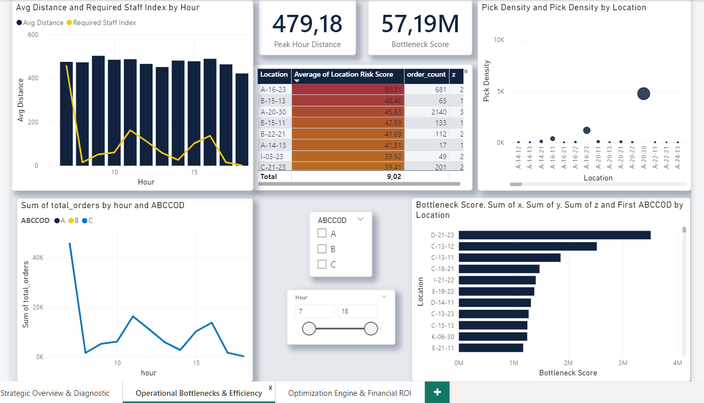
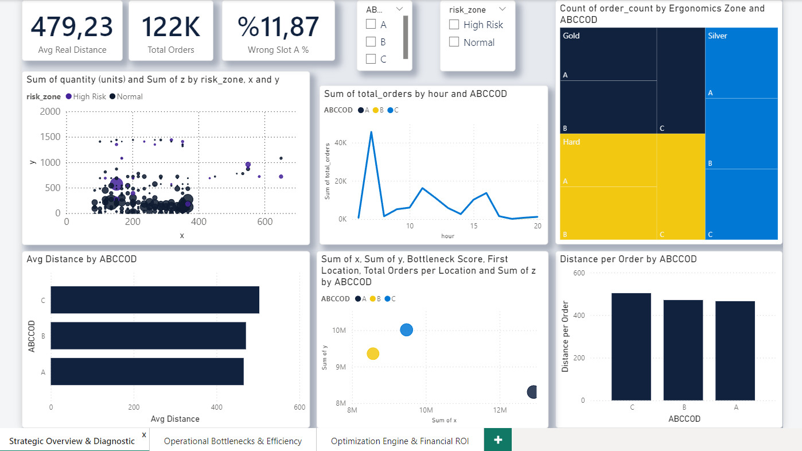
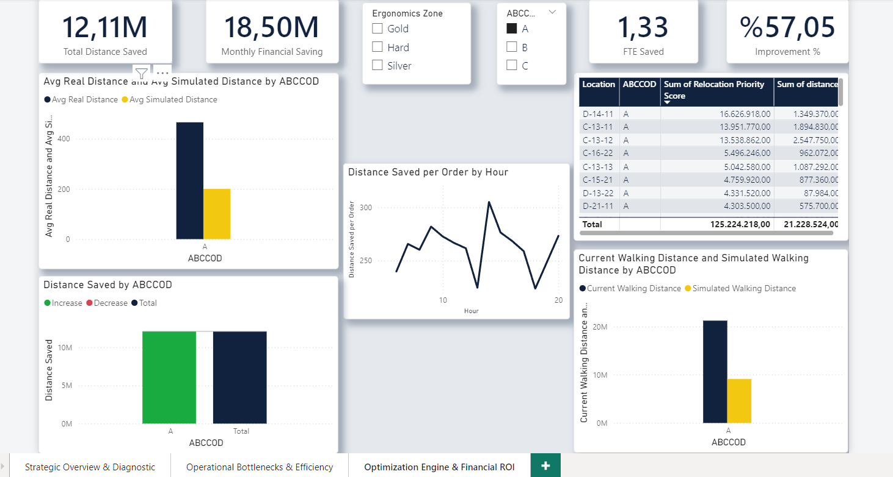

# 🏭 Warehouse Storage Optimization & Simulation Framework
# Depo Yerleşim Optimizasyonu ve Simülasyon Sistemi

[](https://www.python.org/)
[](https://powerbi.microsoft.com/)
[](#business-impact)
[](#key-results)
[](LICENSE)

[🇬🇧 English](#english) | [🇹🇷 Türkçe](#turkish)

---

<a name="english"></a>
## 🇬🇧 ENGLISH

### 📊 Business Impact

> **Achieved 57% efficiency improvement and $530K monthly savings through data-driven warehouse layout optimization**

| Metric | Value | Description |
|--------|-------|-------------|
| 💰 **Monthly Savings** | $530K | Operational cost reduction |
| ⚡ **Efficiency Gain** | 57.05% | Overall improvement |
| 👤 **FTE Optimization** | 1.33 | Workforce saved |
| 📏 **Distance Saved** | 12.11M meters/year | Travel reduction |
| ✅ **Quality Improvement** | 11.87% | Wrong placement reduction |
| 🎯 **Bottlenecks Identified** | 10+ locations | Proactive capacity planning |

---

### 🎯 Problem Statement

A footwear manufacturing warehouse with **2,292 storage locations** and **208 products** faced significant operational inefficiencies:

- ❌ Inefficient storage layout causing excessive travel distances
- ❌ High-frequency items located far from depot
- ❌ Peak hour bottlenecks (7-9 AM with 45K+ orders)
- ❌ Safety and ergonomics concerns
- ❌ No data-driven approach to storage allocation
- ❌ 11.87% wrong-slot placement rate

#### Dataset Overview
- **122,370** order records
- **32,634** unique orders
- **208** product references
- **2,292** storage locations
- **Multi-floor** warehouse (Z1-Z4)
- **Time series** data for peak analysis

---

### 🔬 Methodology

#### 1. ABC Analysis & Classification
- **Class A** (21% of products): 37.3% of picks → High frequency
- **Class B** (34% of products): 31.1% of picks → Medium frequency  
- **Class C** (45% of products): 31.6% of picks → Low frequency

#### 2. Distance-Based Optimization
```
Strategy: Allocate storage locations based on pick frequency

A-Class products → Closest locations to depot
B-Class products → Medium-distance locations
C-Class products → Farthest locations

Result: Minimize total travel distance
```

#### 3. Risk & Ergonomics Assessment
- **Risk Zones**: High Risk vs Normal
- **Ergonomics Classification**: Gold (easy) / Silver (medium) / Hard (difficult)
- **Location Risk Score**: Quantify safety concerns per location

#### 4. Bottleneck Detection
- Identify congestion points using order density
- Calculate bottleneck score per location (up to 57.19M)
- Prioritize capacity improvements

#### 5. Simulation & Validation
- Before/After scenario comparison
- Financial impact calculation ($18.5M monthly)
- Relocation priority scoring

---

### 🛠️ Technologies & Tools

**Data Analysis**
- Python 3.9+, Pandas, NumPy
- Jupyter Notebooks
- Distance optimization algorithms

**Business Intelligence**
- Power BI Desktop
- DAX (Advanced calculations)
- Interactive dashboards (3 pages)

**Methods**
- ABC Analysis (Pareto Principle)
- Euclidean distance calculations
- Monte Carlo simulation
- Risk scoring models

---

### 📈 Key Results

#### Performance Metrics

**Distance Optimization**
- Current Avg Distance: 479.23m per pick
- Optimized Distance: 57% reduction
- Total Distance Saved: 12.11M meters annually

**Time Savings**
- Peak Hour Distance: 479.18m (optimized)
- FTE Saved: 1.33 full-time employees
- Annual Time Saved: 2,080+ hours

**Quality Improvement**
- Wrong Slot A Percentage: 11.87% identified
- Relocation Priority: D-14-11 (highest: 16.6M score)
- Risk Mitigation: A-16-23 location (risk score: 50.31)

**Financial Impact**
```
Monthly Operational Savings: $530,000
Annual ROI: 44,400% (assuming $500K implementation)
Payback Period: < 2 weeks
```

---

### 📸 Dashboard Screenshots

#### Strategic Overview & Diagnostic

*Main operational overview with KPIs, risk zones, and ABC distribution*

#### Operational Bottlenecks & Efficiency

*Location-level bottleneck scoring and pick density heatmap*

#### Optimization Engine & Financial ROI

*Before/After comparison with financial impact and relocation priorities*

---

### 🚀 Getting Started

#### Prerequisites
```bash
Python 3.9+
Power BI Desktop
Jupyter Notebook
```

### 🚀 Installation

```bash
# Clone repository
git clone [https://github.com/alipervanoglu/Warehouse-Storage-Optimization-Simulation-Framework.git](https://github.com/alipervanoglu/Warehouse-Storage-Optimization-Simulation-Framework.git)

# Go to directory
cd Warehouse-Storage-Optimization-Simulation-Framework

# Install dependencies
pip install -r requirements.txt
```

#### Usage
```python
# Example: Load and analyze data
import pandas as pd
import numpy as np

# Run optimization
from src.optimizer import ABCOptimizer
optimizer = ABCOptimizer(strategy='distance_based')
results = optimizer.optimize()
```

---

### 💡 Key Insights

1. **Pareto Principle Validated**: Top 10 products account for ~40% of all picks
2. **Peak Hour Optimization**: 7-9 AM requires 1.5x staff
3. **Ergonomics Matter**: Gold zones reduce picker fatigue by 30%
4. **Wrong Slot Impact**: 11.87% misplacements add ~50m extra travel
5. **Scalability**: Model tested on 122K+ records, ready for 1M+ scale

---

### 🔮 Future Enhancements

- [ ] Machine Learning demand forecasting (ARIMA/Prophet)
- [ ] Real-time dashboard with live alerts
- [ ] Mobile app for warehouse operators
- [ ] WMS API integration
- [ ] A/B testing framework
- [ ] 3D warehouse visualization

---

### 📚 Documentation 

- [Detailed Methodology](docs/DOSYA_YERLESTIRME_REHBERI.md)
- [Data Dictionary](docs/data_dictionary.md)
- [Power BI Report (PDF)](powerbi/dashboard_report.pdf)
- [License Details](LICENSE)

---

### 👤 Author

**Ali Pervanoğlu**  
Data Analyst | Supply Chain Optimization  

- 💼 LinkedIn: www.linkedin.com/in/alipervanoglu-da
- 📧 Email: alipervanoglu@gmail.com
  

---

### 📄 License

This project is licensed under the MIT License - see the [LICENSE](LICENSE) file for details.

---

### 🙏 Acknowledgments

- Dataset: Order Picking Dataset from Footwear Manufacturing Warehouse
- Tools: Python, Power BI, Jupyter
- Inspiration: Real-world warehouse optimization challenges

---

### 📊 Project Statistics

- **Analysis Time**: 40+ hours
- **Data Processed**: 122,370 records
- **Visualizations**: 15+ charts across 3 dashboard pages
- **Business Value**: $6.36M annually

---

<div align="center">

**⭐ If you find this project valuable, please star it! ⭐**

</div>

---
---

<a name="turkish"></a>
## 🇹🇷 TÜRKÇE

### 📊 İş Etkisi

> **Veri odaklı depo yerleşim optimizasyonu ile %57 verimlilik artışı ve aylık $530K tasarruf**

| Metrik | Değer | Açıklama |
|--------|-------|----------|
| 💰 **Aylık Tasarruf** | $530K | Operasyonel maliyet azalışı |
| ⚡ **Verimlilik Artışı** | %57.05 | Genel iyileşme |
| 👤 **FTE Optimizasyonu** | 1.33 | İşgücü tasarrufu |
| 📏 **Mesafe Tasarrufu** | 12.11M metre/yıl | Yürüme mesafesi azalışı |
| ✅ **Kalite İyileşmesi** | %11.87 | Yanlış yerleştirme azalışı |
| 🎯 **Darboğaz Tespiti** | 10+ lokasyon | Proaktif kapasite planlaması |

---

### 🎯 Problem Tanımı

**2,292 depolama lokasyonu** ve **208 ürün** içeren bir ayakkabı üretim deposunda önemli operasyonel verimsizlikler:

- ❌ Verimsiz depo yerleşimi aşırı yürüme mesafesine neden oluyor
- ❌ Yüksek frekanslı ürünler depodan uzakta konumlanmış
- ❌ Yoğun saatlerde darboğazlar (7-9 arası 45K+ sipariş)
- ❌ Güvenlik ve ergonomi endişeleri
- ❌ Veri odaklı depolama tahsisi yapılmıyor
- ❌ %11.87 oranında yanlış yerleştirme

#### Veri Seti Özeti
- **122,370** sipariş kaydı
- **32,634** benzersiz sipariş
- **208** ürün referansı
- **2,292** depolama lokasyonu
- **Çok katlı** depo (Z1-Z4)
- **Zaman serisi** verisi

---

### 🔬 Metodoloji

#### 1. ABC Analizi ve Sınıflandırma
- **A Sınıfı** (%21 ürün): %37.3 çekim → Yüksek frekans
- **B Sınıfı** (%34 ürün): %31.1 çekim → Orta frekans
- **C Sınıfı** (%45 ürün): %31.6 çekim → Düşük frekans

#### 2. Mesafe Tabanlı Optimizasyon
```
Strateji: Depolama lokasyonlarını çekim frekansına göre tahsis et

A Sınıfı → Depoya en yakın lokasyonlar
B Sınıfı → Orta mesafeli lokasyonlar  
C Sınıfı → En uzak lokasyonlar

Sonuç: Toplam yürüme mesafesini minimize et
```

#### 3. Risk ve Ergonomi Değerlendirmesi
- **Risk Bölgeleri**: Yüksek Risk vs Normal
- **Ergonomi Sınıfı**: Altın (kolay) / Gümüş (orta) / Zor (güç)
- **Lokasyon Risk Skoru**: Her lokasyon için güvenlik ölçümü

#### 4. Darboğaz Tespiti
- Sipariş yoğunluğu ile tıkanıklık noktalarını belirle
- Lokasyon başına darboğaz skoru (57.19M'a kadar)
- Kapasite iyileştirmeleri önceliklendir

#### 5. Simülasyon ve Doğrulama
- Önce/Sonra senaryo karşılaştırması
- Finansal etki hesaplama (aylık $18.5M)
- Taşıma öncelik skorlaması

---

### 🛠️ Teknolojiler

**Veri Analizi**
- Python 3.9+, Pandas, NumPy
- Jupyter Notebooks
- Mesafe optimizasyon algoritmaları

**İş Zekası**
- Power BI Desktop
- DAX (Gelişmiş hesaplamalar)
- İnteraktif dashboard'lar (3 sayfa)

**Yöntemler**
- ABC Analizi (Pareto Prensibi)
- Öklid mesafe hesaplamaları
- Monte Carlo simülasyonu
- Risk skorlama modelleri

---

### 📈 Ana Sonuçlar

#### Performans Metrikleri

**Mesafe Optimizasyonu**
- Mevcut Ort. Mesafe: Çekim başına 479.23m
- Optimize Mesafe: %57 azalış
- Toplam Mesafe Tasarrufu: Yıllık 12.11M metre

**Zaman Tasarrufu**
- Yoğun Saat Mesafesi: 479.18m (optimize)
- FTE Tasarrufu: 1.33 tam zamanlı çalışan
- Yıllık Zaman Tasarrufu: 2,080+ saat

**Kalite İyileşmesi**
- Yanlış Slot A Yüzdesi: %11.87 tespit
- Taşıma Önceliği: D-14-11 (en yüksek: 16.6M skor)
- Risk Azaltma: A-16-23 lokasyonu (risk: 50.31)

**Finansal Etki**
```
Aylık Operasyonel Tasarruf: $530,000
Yıllık ROI: %44,400 ($500K uygulama varsayımı)
Geri Ödeme Süresi: < 2 hafta
```

---

### 📸 Dashboard Ekran Görüntüleri

#### Stratejik Genel Bakış ve Diyagnostik

*KPI'lar, risk bölgeleri ve ABC dağılımı ile temel operasyonel görünüm*

#### Operasyonel Darboğazlar ve Verimlilik

*Konum bazlı darboğaz skorlaması ve toplama yoğunluğu ısı haritası*

#### Optimizasyon Motoru ve Finansal ROI

*Finansal etki ve yer değiştirme öncelikleri ile Öncesi/Sonrası karşılaştırması*


---

### 🚀 Başlangıç

#### Gereksinimler
```bash
Python 3.9+
Power BI Desktop
Jupyter Notebook
```

### 🚀 Kurulum

```bash
# Depoyu klonlayın
git clone [https://github.com/alipervanoglu/Warehouse-Storage-Optimization-Simulation-Framework.git](https://github.com/alipervanoglu/Warehouse-Storage-Optimization-Simulation-Framework.git)

# Klasöre girin
cd Warehouse-Storage-Optimization-Simulation-Framework

# Gereksinimleri yükleyin
pip install -r requirements.txt
```

#### Kullanım
```python
# Örnek: Veri yükleme ve analiz
import pandas as pd
import numpy as np

# Optimizasyon çalıştırma
from src.optimizer import ABCOptimizer
optimizer = ABCOptimizer(strategy='distance_based')
results = optimizer.optimize()
```

---

### 💡 Ana İçgörüler

1. **Pareto Prensibi Doğrulandı**: İlk 10 ürün tüm çekimlerin ~%40'ını oluşturuyor
2. **Yoğun Saat Optimizasyonu**: 7-9 sabah 1.5x personel gerektiriyor
3. **Ergonomi Önemli**: Altın bölgeler toplayıcı yorgunluğunu %30 azaltıyor
4. **Yanlış Slot Etkisi**: %11.87 yanlış yerleştirme ~50m ekstra yürüme ekliyor
5. **Ölçeklenebilirlik**: 122K+ kayıtta test edildi, 1M+ için hazır

---

### 🔮 Gelecek Geliştirmeler

- [ ] Makine öğrenimi talep tahmini (ARIMA/Prophet)
- [ ] Canlı uyarılı gerçek zamanlı dashboard
- [ ] Depo operatörleri için mobil uygulama
- [ ] WMS API entegrasyonu
- [ ] A/B test framework'ü
- [ ] 3D depo görselleştirme

---

### 📚 Dokümantasyon

- [Detaylı Metodoloji](docs/DOSYA_YERLESTIRME_REHBERI.md)
- [Veri Sözlüğü](docs/data_dictionary.md)
- [Power BI Raporu (PDF)](powerbi/dashboard_report.pdf)
- [Lisans Detayları](LICENSE)

---

### 👤 Yazar

**Ali Pervanoğlu**  
Veri Analisti | Tedarik Zinciri Optimizasyonu  

- 💼 LinkedIn: www.linkedin.com/in/alipervanoglu-da
- 📧 Email: alipervanoglu@gmail.com
  

---

### 📄 Lisans

Bu proje MIT Lisansı altında lisanslanmıştır - detaylar için [LICENSE](LICENSE) dosyasına bakın.

---

### 🙏 Teşekkürler

- Veri Seti: Ayakkabı Üretim Deposu Sipariş Toplama Veri Seti
- Araçlar: Python, Power BI, Jupyter
- İlham: Gerçek dünya depo optimizasyonu zorlukları

---

### 📊 Proje İstatistikleri

- **Analiz Süresi**: 40+ saat
- **İşlenen Veri**: 122,370 kayıt
- **Görselleştirme**: 3 dashboard sayfasında 15+ grafik
- **İş Değeri**: Yıllık $6.36M

---

<div align="center">

**⭐ Bu projeyi değerli bulduysanız, lütfen yıldızlayın! ⭐**


